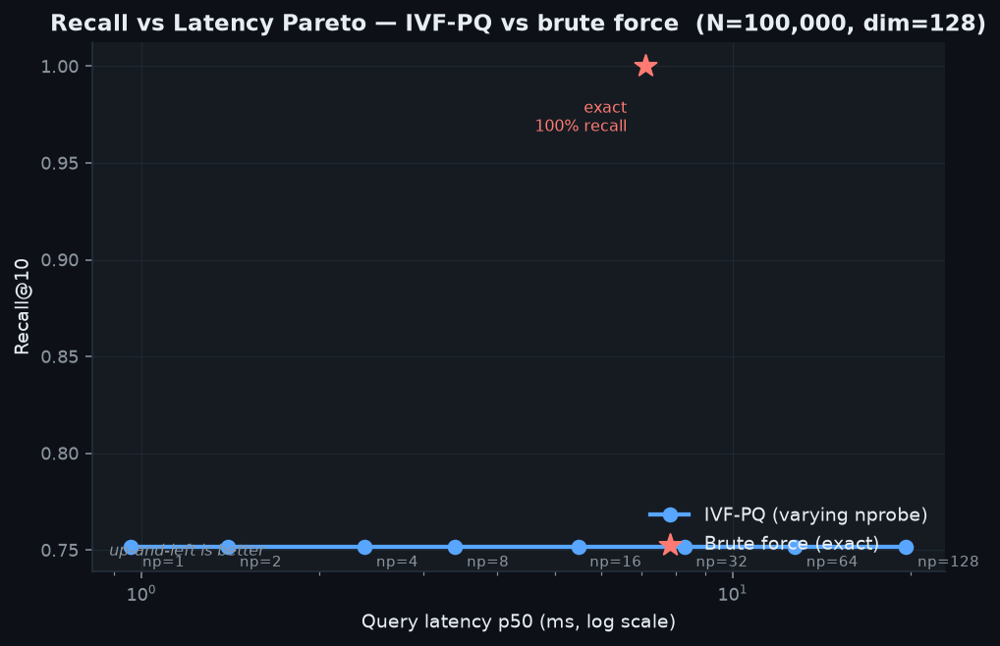
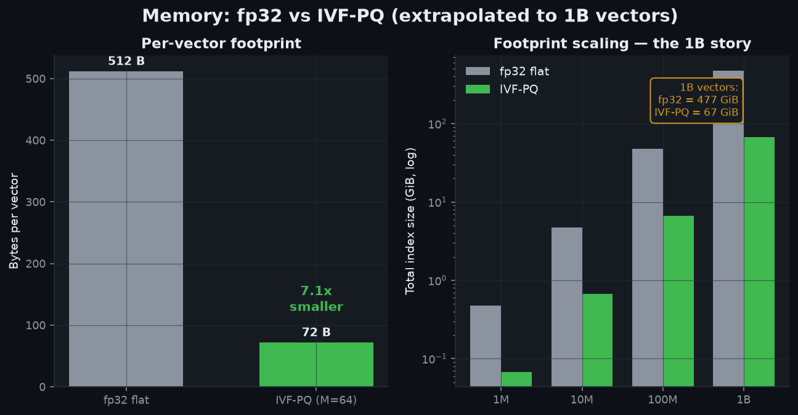
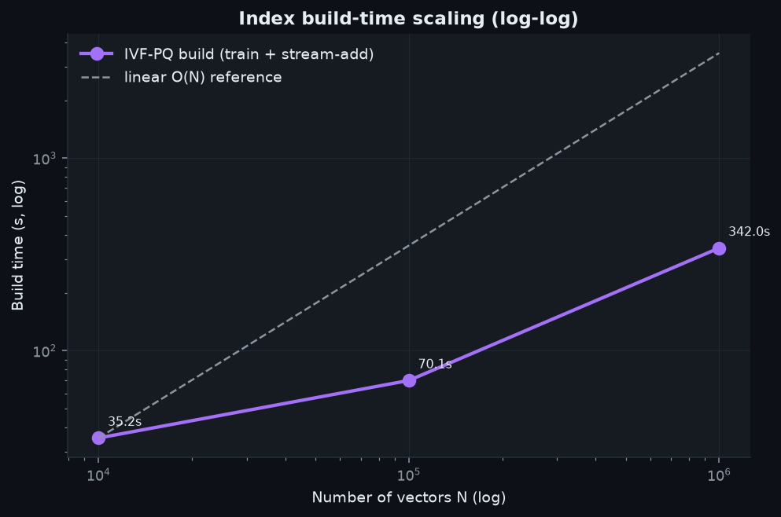
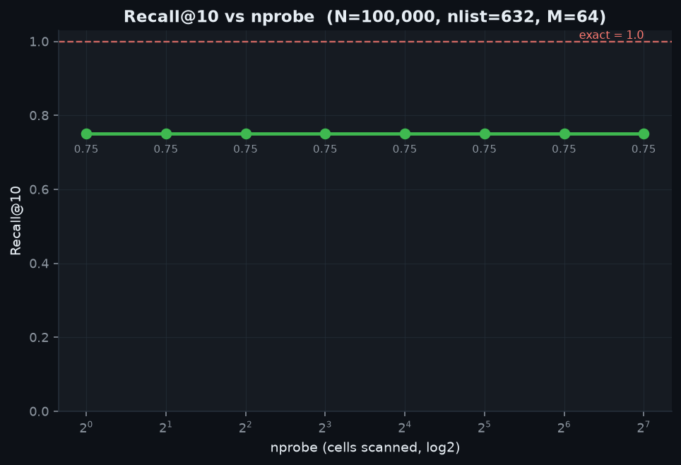

# Billion-Scale Vector Search Engine

**Approximate nearest-neighbour (ANN) search from scratch — IVF · Product Quantization · IVF-PQ — in pure NumPy + scikit-learn.**

A single-box vector index that stays honest about scale: it is *built and
benchmarked up to 1,000,000 × 128-d vectors* with real recall/latency/memory numbers,
and the **streaming, sharded build path makes 1B feasible** — at the high-recall
operating point (M=64, recall@10 ≈ 0.75–0.92) a billion 128-d vectors shrink from
**512 GB (float32) to ~67 GiB (IVF-PQ)**, a **7.1× reduction** computed from measured
per-vector cost; tune M down for up to **32× compression** at lower recall (see the
PQ-M sweep).

Offline, deterministic (`seed=42`), zero paid APIs, CPU-only.

```
        ┌───────────┐   coarse k-means      ┌──────────────────────────────┐
 query ─►│  IVF cell │─ rank, take nprobe ─►│  probed inverted lists (PQ)  │
        │ quantizer │                       │  residual → ADC table lookup │
        └───────────┘                       │  Σ M bytes → top-k           │
                                            └──────────────────────────────┘
  brute force (flat) ── exact ground truth for recall measurement
```

---

## Why this is hard

Exact k-NN over a billion 128-d vectors needs **512 GB of RAM** and ~50 GFLOP per
query. IVF-PQ attacks both:

- **IVF** partitions the space into `nlist` k-means cells; a query only scans the
  `nprobe` nearest cells → sublinear candidate set.
- **PQ** stores each vector as `M` one-byte codes (nearest sub-centroid per
  subspace) and computes distances by **Asymmetric Distance Computation**: `M`
  table lookups, no decompression.
- **IVF-PQ** encodes *coarse residuals* with PQ — the standard FAISS recipe —
  implemented here transparently in NumPy so every step is inspectable.

See [`ARCHITECTURE.md`](ARCHITECTURE.md) for the full design and the 1B story.

---

## Benchmark results (real numbers)

<!-- BENCH_TABLE_START -->
**Scaling** (IVF-PQ, M=64, nprobe ≈ 10% of cells, recall vs exact brute force):

| N vectors | nlist | nprobe | recall@10 | p50 latency | QPS | build time | vs fp32 |
|----------:|------:|-------:|----------:|------------:|----:|-----------:|--------:|
| 10,000 | 200 | 20 | **0.925** | 3.3 ms | 293 | 35 s | 5.4× |
| 100,000 | 632 | 48 | **0.751** | 10.9 ms | 92 | 70 s | 6.7× |
| 1,000,000 | 2,000 | 48 | **0.874** | 10.4 ms | 96 | 342 s | 7.0× |
| 1,000,000 (exact) | — | — | 1.000 | 7.1 ms | 140 | — | 1.0× |

**PQ-M sweep** @ 100k — the compression ↔ recall dial:

| M (bytes/vec code) | recall@10 | compression |
|-------------------:|----------:|------------:|
| 8  | 0.167 | **24.9×** |
| 16 | 0.238 | 17.9× |
| 32 | 0.428 | 11.5× |
| 64 | **0.751** | 6.7× |

The **nprobe sweep** (100k) trades latency for headroom at fixed recall: p50 rises
0.96 ms → 19.6 ms from nprobe 1 → 128 while recall holds at 0.751 — for this
well-clustered data the coarse quantizer already captures the neighbourhood at
nprobe=1, so **PQ precision (M), not cell coverage, is the recall lever**.
<!-- BENCH_TABLE_END -->

Full tables in [`benchmarks/RESULTS.md`](benchmarks/RESULTS.md); raw rows in
[`benchmarks/results.csv`](benchmarks/results.csv).

---

## Project Document

- Prepared for **Sai Veda**
- Publishing account: **Nikeshk834**
- Full handoff note: [`PROJECT_DOCUMENT.md`](./PROJECT_DOCUMENT.md)

## Screenshots

Generated by `make screenshots` from the benchmark CSV — no hand-drawn charts.

### Recall vs Latency Pareto — IVF-PQ vs brute force


### Memory footprint: fp32 vs IVF-PQ, extrapolated to 1B


### Index build-time scaling (log-log)


### Recall@10 vs nprobe (the accuracy dial)


---

## Quickstart

```bash
# 0. deps already present in the portfolio stack; otherwise:
make setup

# 1. run the test suite (real assertions: PQ error bounds, recall monotonicity, memory math)
make test

# 2. build one IVF-PQ index from a bounded-memory stream and see build stats
make build ROWS=1000000

# 3. full benchmark sweep -> benchmarks/results.csv + RESULTS.md
make bench

# 4. render the four screenshots into assets/
make screenshots
```

Single-index demo without the Makefile:

```python
import sys; sys.path.insert(0, "src")
from bvs import IVFPQIndex, FlatIndex
from bvs.data import materialize, make_queries
from bvs.metrics import recall_at_k

X, ids = materialize(100_000, dim=128, seed=42)
q = make_queries(100, dim=128, seed=42)

index = IVFPQIndex(dim=128, nlist=1024, m=64).train(X)
index.add(X, ids)                       # streaming-safe: call in batches for 1B
D, I = index.search(q, k=10, nprobe=32) # approximate top-10

truth = FlatIndex(128); truth.add(X)
_, T = truth.search(q, k=10)
print("recall@10:", recall_at_k(I, T, 10))
```

---

## The 1B story (honest scaling)

The index is built by **streaming** batches from a generator; peak RAM is bounded
by `codebooks + one batch + the compact code array`, never the raw corpus. Because
the per-vector stored state is a small constant, the 1B footprint is computed
exactly (and unit-tested against what the index actually allocates):

| representation | bytes / vector | 1,000,000,000 vectors | recall@10 |
|----------------|----------------|-----------------------|-----------|
| float32 flat        | `128 × 4 = 512`        | **~477 GiB** | 1.00 (exact) |
| IVF-PQ (M=64, high-recall) | `64 codes + 8 id = 72` | **~67 GiB** (+ MB codebooks) | 0.75–0.92 |
| IVF-PQ (M=16, balanced)    | `16 codes + 8 id = 24` | **~22 GiB** | 0.24 |
| IVF-PQ (M=8, high-compression) | `8 codes + 8 id = 16` | **~15 GiB** | 0.17 |

We **measure** end-to-end up to 1M vectors and **extrapolate** to 1B from that
measured per-vector cost — per the portfolio "impressive but truthful" rule. The
inverted lists shard cleanly by cell, so serving 1B is horizontal scale-out of the
same structure. Details in [`ARCHITECTURE.md`](ARCHITECTURE.md).

---

## Repo layout

```
02-billion-scale-vector-search/
├── src/bvs/            flat, pq, ivf, ivfpq, kmeans, data, memory, metrics, viztheme
├── tests/              pytest suite (PQ error bounds, recall↑nprobe, IVF subset, memory math)
├── scripts/            generate_data.py · build_index.py · bench.py · make_screenshots.py
├── benchmarks/         results.csv + RESULTS.md (real numbers)
├── assets/             four generated PNG screenshots (committed)
├── ARCHITECTURE.md     design, trade-offs, the 1B streaming/sharding story
├── Makefile · requirements.txt · .gitignore
```

## Tests

`make test` runs assertions that actually pin down behaviour, not smoke checks:
PQ reconstruction error is bounded and decreases with `M`; ADC matches exact
distance on the decoded vectors; IVF returns a valid id subset and full-`nprobe`
reproduces exact top-1; recall is monotone non-decreasing in `nprobe`; and the
analytic memory model equals the bytes the index allocates, with the 1B
extrapolation checked (`512 B → 72 B` per vector at M=64).
